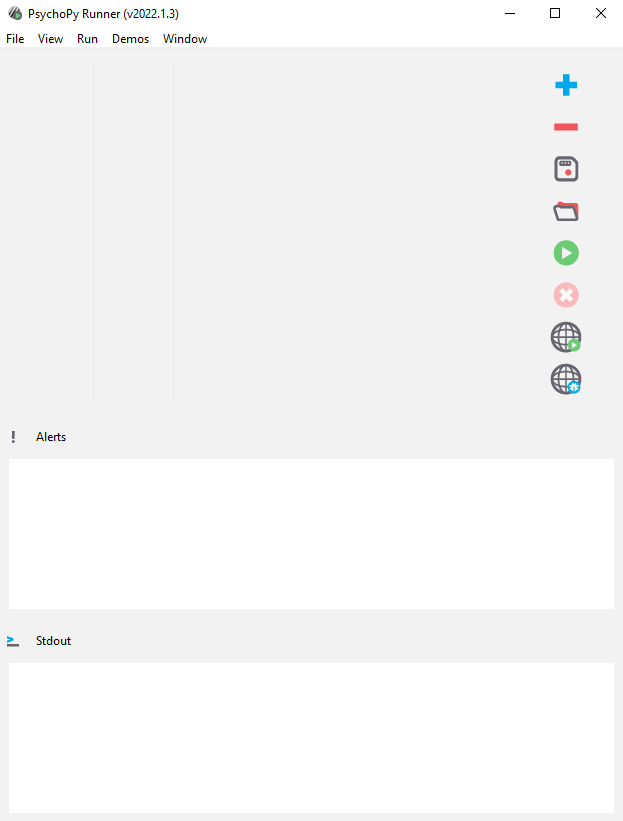
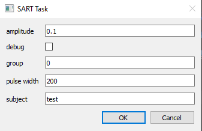

# Overview for SART task with taVNS

The first step in running the SART task (and any other taVNS experiment) is to determine the perceptual threshold for taVNS stimulation for a particular participant.

Within this folder, there is a file called taVNS_plus_SART_expr.psyrun. Double click this file and Psychopy will start up, and after a long splash-loading screen, will show a file selection screen that is empty. 

- Click on File --> Open list
- Select taVNS_pluse_SART_expr.psyrun (the same file you originally clicked on)

This will load two lines to the Psychopy Runner interface:
1. taVNS_Staircase.py
2. SART_taVNS.py

Click on the `taVNS_Staircase.py` line, and on the right the white arrow within the green circle will become selectable. Clicking on this button with run the selected script. 

