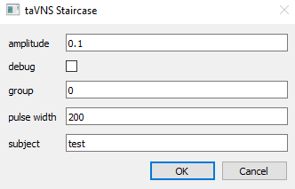
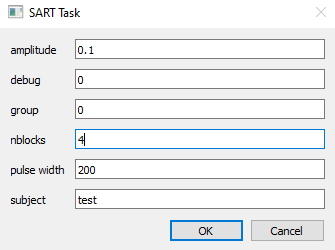

# Overview for SART task with taVNS

The first step in running the SART task (and any other taVNS experiment) is to determine the perceptual threshold for taVNS stimulation for a particular participant.

Within this folder, there is a file called taVNS_plus_SART_expr.psyrun. Double click this file and Psychopy will start up, and after a long splash-loading screen, will show a file selection screen that is empty. 


- Click on File --> Open list
- Select taVNS_plus_SART_expr.psyrun (the same file you originally clicked on)

This will load two lines to the Psychopy Runner interface:
1. taVNS_Staircase.py
2. SART_taVNS.py

## 1. Preparing the participant 

This is a quick reminder of what to do if you are applying Ag/AgCl electrodes to the cymba concha using silicone putty. For details and images, refer to "taVNS_Participant_Prep_Flowchart.jpg" and "Sample-Safety-Checklist.md" in the Information folder of this repository:

1. Use a q-tip and alcohol / alcohol wipe / sanitizer to clean and abrade the ear. Focus on the target stimulation sites. 
2. Have participant press the putty into their ear to make a mold. You can help them get started, and point out the area near the cymba concha as being especially important to press into.
3. Carefully remove putty
4. Embed electrodes in target positions on the earpiece (red cathode electrode goes on the top ridge, where the cymba concha will be, blue anode electrode goes on bottom where cymba cavum would be). 
5. Add a small amount of conductive gel to electrodes (make sure that the gel doesn't connect the two electrodes to each other). 
6. Carefully put the mold back into place in the ear, and have the participant press it into place to secure it. 
7. On the stimulator, quickly turn the switch on the front of the stimulator from "V" to "I" and back again, while watching the red indicator light. If the red indicator light shines brightly, this means that the impedance is too high. First have the participant try pressing the electrodes more firmly into their ear and repeat. If the red indicator light still shines brightly, start over from scratch. 
8. Ensure that the switch on the front of the stimulator is set to "V". 
9. Continue to perceptual threshold identification. 

## 2. Identifying the perceptual threshold

Click on the `taVNS_Staircase.py` line, and on the right panel the white arrow within the green circle will become selectable. Clicking on this button with run the selected script. When the script runs, you should see the following input screen. 



- *amplitude*: should be set to 0.1 to begin. 
- *debug*: should be unchecked (check this box to run without any stimulation)
- *group*: if using a group name (e.g., the name of the experiment), fill this in here, otherwise leave 0
- *pulse width*: use the default value of 200 for determining the threshold
- *subject*: the unique identifier for the participant

After entering the unique participant identifier in the subject field, click \*OK\* to begin the staircase script. 

The screen will turn black, after which the following instructions will appear (that you should read out loud to the participant):
```
"You will receive short bursts of stimulation.
This can feel like a sudden warming, tingling, or tapping sensation.
Whenever you are certain that you felt the stimulation, please say so out loud.
If you are unsure, remain silent. Only respond if you are certain that you felt the stimulation"
```

### -------- AT THIS POINT, CHANGE THE SWITCH ON THE FRONT OF THE STIMULATOR FROM `"V"` to `"I"` --------


After pressing space, the screen with show a fixation cross ('+'). This indicates that stimulation is occurring. After each trial, the following two choices will show up on the screen: 
```
1 = Didn't feel it.   2 = Felt it.
```

At first, the stimulation amplitude should be low enough that the participant does not feel anything. Wait a moment, and if the participant remains silent, press "1" to continue to the next trial at a higher amplitude. The fixation cross will reappear, indicating that stimulation is occurring, and then the same response options will appear on screen. Once the participant reports feeling the stimulation, press "2". The amplitude will drop by 0.3mA on the subsequent trial, and then begin to increase again every time you press "1". After the participant has reported feeling the stimulation eight times (after you have pressed "2" eight times), the script will end and a plot will appear on the screen that should look something like this:


At the same time, the text output window of the PsychoPy Runner program will report the perceptual threshold (average amplitude after the first time the participant reported feeling sensation) and the target "stim level" (Threshold - 0.2mA):
```
----
Threshold = 1.0, stim level = 0.8
---- 
```

For the threshold to be accurate, the responses from the participant need to be relatively stable. In the example image above, the exact amplitude at which the participant reports being able to feel the stimulation varies a bit around 1-1.1mA, but not by much. This would be considered a good staircase. However, if you see something like the following, you should re-run the staircase script: 


In this example directly above, the point at which the participant reported stimulation varies greatly. This can occur if the electrodes move around due to the putty being unstable, or if the participant is reporting stimulation when actually they can't feel it, or some other reason. Again, if the threshold does not appear relatively stable, re-run the script (and repeat to the participant that they should only respond when they are certain that they have felt stimulation). If the threshold is still very unstable, consider reapplying the electrodes. 

If everything looks okay, record the stim level, then close the figure by pressing the "X" at the top right of the window.

## 3. Running the SART task

Click on the `SART_taVNS.py` line in the PsychoPy Runner window, and on the right panel the white arrow within the green circle will become selectable. Clicking on this button with run the selected script. When the script runs, you should see the following input screen. 



The primary fields that need to be changed are `amplitude` and `subject`. 
1. For `subject`, enter the same unique identifier used during the Threshold staircase.
2. For `amplitude`, enter the `stim level` value that was produced by the staircase procedure. 

Press "OK" and the script will run. When the instruction screen appears, place the computer in front of the participant where they can respond easily. Have them read the instructions, and then run the task. 

## 4. Cleanup

### -------- FIRST, CHANGE THE SWITCH ON THE FRONT OF THE STIMULATOR FROM `"I"` to `"V"` --------
